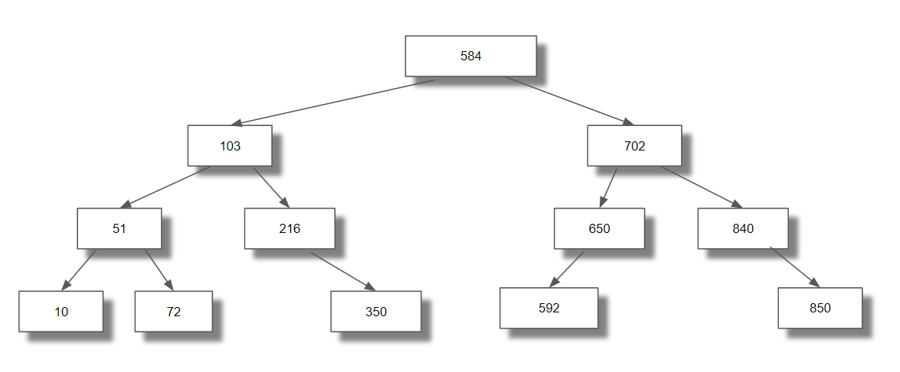
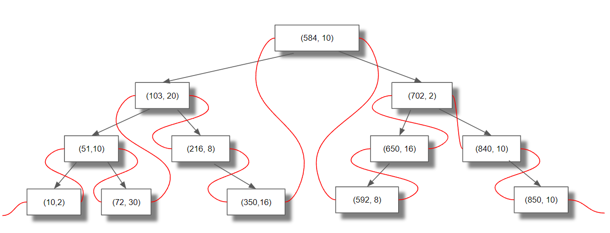
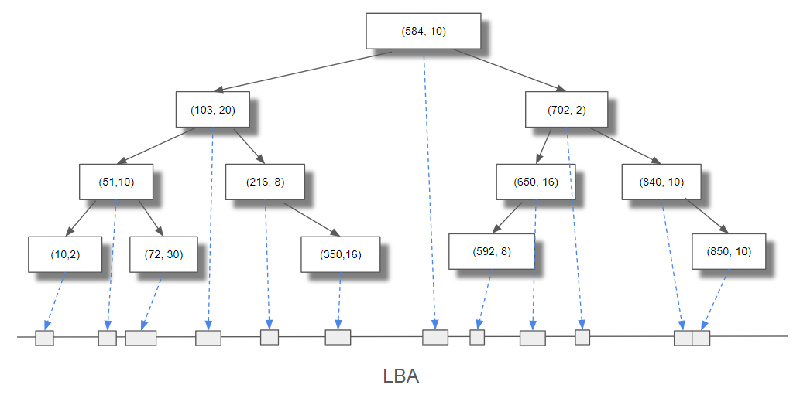
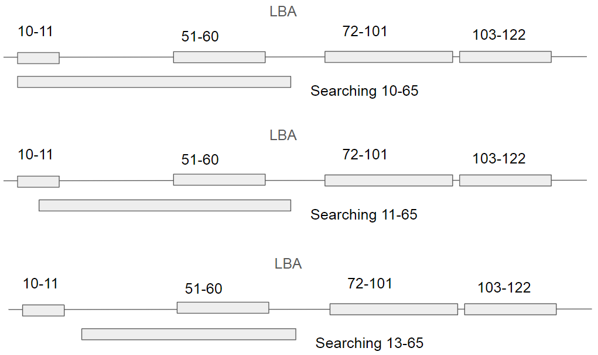
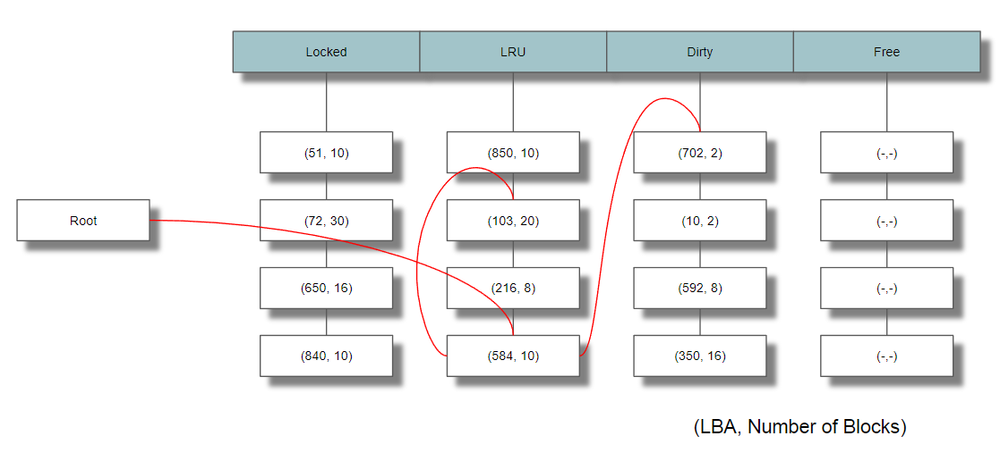

# Threaded AVL tree for block device caching application

## Introduction
Block devices need memory buffer to handle the speed gap between storage media and the host interfaces. The memory buffer is also used as buffer cache, either to retain the data for future read transfer or temporarily save dirty data to commit to storage media later.

As the memory buffer size increases, block devices need to handle more number of data fragments, often referred as cache segments. For block devices, it is common for each cache segment to contain multiple blocks of data. As each cache segment may contain many blocks of data, it would quickly become inefficient to use conventional binary tree to track all blocks in a cache segment.

This project is an example of using a balanced binary tree, more specifically AVL tree, in conjunction with an LBA (Logical Block Address) ordered list. This list is referred as Thread, thus resulting the name, Threaded AVL. The goal of this implementation is to manage the coherency of data using the Thread, while minimizing the search latency by using the AVL tree.

In addition, this projects includes multiple lists that are ordered either time domain or spatial domain. Each list contains a specific type of cache segments.

Please note that while the name and the purpose might be same, this implementation is slightly different than conventional threaded binary tree as explained below.

https://en.wikipedia.org/wiki/Threaded_binary_tree

In the above conventional threaded binary tree, a node may not point to the immediate prior/next node. This implies additional latency when searching for the node with higher/lower LBA.

## Conventional AVL tree

AVL tree guarantees that the tree is balanced and the difference in depth between the shortest path and the longest path from any node (including the root) to the bottom is no bigger than one.

In other words, the worst case search latency is bound by the log of the total number of nodes in the tree.

To maintain the tree balanced, each insert operation to a sub-tree is followed by a potential rebalancing of the sub-tree.

Each node contains a key. When searching an AVL tree for a node with a matching key, the result is either success or failure. Success is represented by returning a valid pointer to the node with matching key. An invalid pointer (i.e. NULL) indicates a failure - there was no node with such key.

### Conventional AVL Tree


## Threaded AVL tree

To support searching and inserting a node with a range of blocks instead of a single block, each node contains an LBA key and a number of blocks. And each and every node in the tree is a part of LBA ordered list - Thread.

To be used for caching application, the tree needs to be coherent - there shouldn't be any range overlap between any nodes.

Note that this project does not include the coherency management as the operation is heavily depedent on the features provided by storage controllers. This will be commented in the last section.

### TAVL Tree


A slightly different presentation of the Threaded AVL tree is below.

Hopefully, the figure below conveys the point that the actual cache scan is done using the thread and the AVL tree is only there to provide a quick way to locate the node in the thread to start the cache scan.

### TAVL Tree with visually separated Thread


When searching a Threaded AVL tree for a node with a matching key, the result is not a clear success or failure. The search returns a valid pointer to the node that has a key which is equal to or smaller than the LBA to be searched. An invalid pointer (i.e. NULL) indicates that there is no node with such key.

The reason for returning the node with a key that is equal to or smaller than the LBA is that such node is the one with the lowest key that may have an overlap with LBA range searched.

The examples in the figure below show why TAVL search needs to return a node with a key that is equal to or smaller than the LBA being searched. Depending on the range, such node may or may not overlap with the LBA range. Traversing the thread to the right will pass all nodes that overlap with the LBA range being searched.

### Examples of TAVL search


## Overall construction

TAVL tree allows all cache segments to be sorted in spatial domain. As there is a limited number of cache segments, cache segments need to be tracked in time domain too.

After initialization, all cache segments are pushed to the free list. As long as the free list is not empty, allocating a new cache segment is done by popping the head of the free list.

The free list will eventually become empty and the oldest cache segment needs to be recycled. This is done by tracking nodes with the LRU list. The head of the LRU list contains the node that is the oldest of all nodes in the LRU list. If the free list is empty, the node at the head of the LRU list is invalidated, popped and used.

The dirty list contains cache segments for write data. A cache segment in the dirty list cannot be moved to other lists till the write data is written to the media. Once the write data is written, the node can be moved to the LRU list or the free list. Cache segments in the dirty list do not have to be ordered based on the time. Block devices may apply reodering schemes like elevator reordering or three-dimensional reordering. Certain reordering scheme may require more than one list to manage cache segments before and after reodering. This project simply uses a linked list and does not include any reordering scheme or any list structure for reordering scheme.

The locked list may contain promoted cache segments - promoted as there were cache hits for those, implying that there might be future cache hits on those. In such case, the locked list acts like the LRU list and whichever oldest cache segment in the locked list gets demoted into the LRU list when necessary. In another case where the locked list contains truly locked cache segments, each cache segment needs to have a reference counter that prevents the cache segment from getting removed from the locked list till the counter decrements to 0. This is typical in a system where cache search and cache update are independently done in separate threads.

### Simplified diagram of the overall construction


### Lists
| List | Type | Domain | Purpose |
| --- | --- | --- | --- |
| Locked | Bidirectional | Time | To track promoted cache segments |
| LRU | Bidirectional | Time | To track the age of each cache segment |
| Dirty | Bidirectional/Circular | Time or LBA | To reorder writes in the most efficient sequence |
| Free | Bidirectional | Time | To keep invalidated and freed cache segments |

## Considerations for application

How exactly this TAVL caching scheme can be used in block devices largely depends on the storage controller.

For example, if a storage controller supports SGL buffer, 
- multiple cache segments with consecutive LBA ranges, can be merged together to form a single buffer to be managed and transferred
- a cache segment with an LBA range that gets partially invalidated by a new LBA range can be shrunken to keep a valid range, instead of getting thrown away

This is why TAVL cache search in this implementation only returns the node to start traversing. Depending on whether SGL buffer is supported, the caller can either invalidate or shrink all cache segments with overlap.

With SGL buffer, TAVL search result for write will be handled as following.
* TAVL search returns a cache segment
* By comparing the LBA ranges, check if the first part of the required LBA range exists in the cache segment
* Traverse to the right cache segment in the thread till the cache segment has an LBA that is outside of the required LBA range
* Invalidate either partial or full range of cache segments that overlap with the write range - do not stop at a gap
* If partially invalidated, keep the cache segment and just free the portion of the buffer. If fully invalidated, move the invalidated cache segment to the free list
* Insert the new cache segment into the TAVL tree and the dirty list

Without SGL buffer, TAVL search result for write will be handled similarly but without freeing a portion of the buffer. 

For write, data coherency is managed by invalidating all cache segments that overlap with the new range.

With SGL buffer, TAVL search result for read will be handled as following.
* TAVL search returns a cache segment
* By comparing the LBA range, check if the first part of the required LBA range exist in the cache segment
* Traverse to the right cache segment in the thread till a cache segment with an LBA that is outside of required LBA range, or till there is a gap
* Merge all sequential cache segments for host transfer
* If there are more blocks to read, start media read operation

For read, data coherency is managed when inserting a cache segment either before or after reading from the media.

NOTE : 
The test code in main.c,
- creates 100 cache segments into the free pool,
- assigns a random LBA [0.1999] with random number of blocks [10..29] to each cache segment,
- inserts each cache segment into TAVL tree and LRU list,
- finds & invalidates any cache segments in the TAVL tree with range overlap, to maintain coherency,
- once all cache segments (except the ones invalidated due to an overlap) are in TAVL tree, dump the content of the TAVL tree,
- then removes each and every cache segment in the thread,
- checks if both the TAVL tree and the LRU list are empty.

It assumes that any cache segments with overlap need to be invalidated & freed. In other words, it behaves like there is no buffer SGL support.

Example of TAVL tree dump :

l-l-l-l-l-(49..73) : From the root, take left-left-left-left-left to arrive to the node with LBA from 49 till 73.

(1258..1276) : The root of the TAVL tree with LBA from 1258 till 1276.

```
l-l-l-l-l-(49..73)
l-l-l-l-(75..87)
l-l-l-(132..142)
l-l-l-r-l-(166..182)
l-l-l-r-(198..212)
l-l-(213..226)
l-l-r-(247..268)
l-l-r-r-(288..306)
l-l-r-r-r-(331..349)
l-(354..371)
l-r-l-l-l-(483..506)
l-r-l-l-l-r-(543..558)
l-r-l-l-(573..583)
l-r-l-l-r-(587..605)
l-r-l-(623..638)
l-r-l-r-l-(689..711)
l-r-l-r-(749..772)
l-r-l-r-r-(782..797)
l-r-(797..825)
l-r-r-l-l-(829..857)
l-r-r-l-l-r-(900..914)
l-r-r-l-(950..977)
l-r-r-(979..1002)
l-r-r-r-l-(1060..1071)
l-r-r-r-(1093..1110)
l-r-r-r-r-(1192..1208)
(1258..1276)
r-l-l-(1299..1321)
r-l-l-r-(1342..1360)
r-l-(1388..1403)
r-l-r-(1434..1449)
r-(1502..1515)
r-r-l-l-l-(1552..1580)
r-r-l-l-(1581..1592)
r-r-l-(1597..1623)
r-r-l-r-l-(1662..1682)
r-r-l-r-l-r-(1684..1709)
r-r-l-r-(1751..1778)
r-r-(1787..1813)
r-r-r-l-(1849..1871)
r-r-r-l-r-(1871..1900)
r-r-r-l-r-r-(1904..1919)
r-r-r-(1952..1964)
r-r-r-r-(1967..1979)
```
